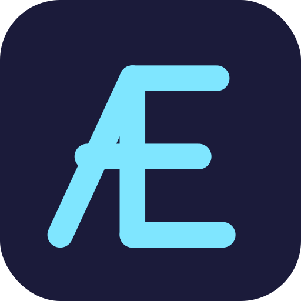

# Aether



**Aether is a small, statically-typed programming language designed to be
written by language models.** It compiles and runs real programs — typed records
with methods, `@pure` contracts, effect-scoped I/O, integer and real arithmetic,
and first-class JSON/TOON parsing — through a small, regular grammar. What sets
it apart is the design goal: a model should be able to produce *valid, correct*
Aether **with no reference guide in its prompt**, and the language is shaped by
what capable models actually reach for, not by taste.

```aether
@pure
fn classify(score: Int) -> Text {
    if score >= 90 { ret "distinction"; }
    if score >= 70 { ret "merit"; }
    ret "pass";
}

fn main() -> Void {
    fx { println("Ava: ", classify(92)); }   // Ava: distinction
    ret;
}
```

When a capable model consistently reaches for a construct that does not exist —
or trips on one that does — that is treated as a language bug and fixed. The
benchmark, not opinion, is the instrument: see the
[findings](docs/aether_specialization_findings.md) and the
[design rationale](docs/aether_architecture_and_rationale.md).

## You don't have to fine-tune a model to use it

Fine-tuning is the research frontier, but it isn't the cost of entry. The
condensed guide
([`aether_for_llms_with_small_contexts.md`](docs/aether_for_llms_with_small_contexts.md),
~500 lines) pasted into the prompt gets a frontier model that has *never seen
Aether* writing valid, correct programs a surprising fraction of the time — the
grammar is small and regular enough to pick up in-context.

And the loop closes. When a model slips, the compiler doesn't just reject the
code: it names the mistake and tags it with a stable error code — `FX-001` for an
effect used outside an `fx` block, `ANN-001` for a misplaced contract, `TOON-001`
for a malformed TOON handle, and so on. Those same codes are section headings in
the guide, so the diagnostic points straight back to the paragraph that explains
the fix. A model can read its own error and correct the program on a second pass.

Measured: in the [guided benchmark](docs/aether_guided_benchmark.md), a 120B
model writes the **full 30-task v2 benchmark correctly** from the guide alone —
no fine-tuning (and in the broader archived sweep, so does a 122B).

## How it runs

Aether is a contract- and effect-typed front end for the **PSCAL** VM. It lowers
to [Rea](https://github.com/emkey1/rea): it parses its own source, runs its own
semantic analysis (effects, purity, contracts), and emits the shared PSCAL AST,
which the shared bytecode compiler lowers and the PSCAL VM runs. It carries no VM
or front-end engine of its own — it reuses the shared Rea engine and installs its
overrides (parser, semantic analysis, diagnostics, source rewriting) through the
engine's hook seam (`rea`'s `src/rea/frontend_hooks.h`) via
`aetherInstallFrontendHooks()`. The dependency chain is **aether → rea →
pscal-core**. `rea` and `pscal-core` are vendored as git submodules under
`external/` and wired in through CMake `FetchContent` (`SOURCE_DIR`).

## Build

`rea` and `pscal-core` are vendored as git submodules under `external/`, so clone
recursively. A plain clone leaves `external/` empty and the build fails.

```sh
git clone --recurse-submodules https://github.com/emkey1/aether.git
cd aether
cmake -S . -B build      # builds aether against external/{rea,pscal-core}
cmake --build build -j
./build/aether --no-cache program.aether
```

Already cloned without `--recurse-submodules`? Run `git submodule update --init
--recursive` once, then build.

## Install

```sh
cmake --install build --prefix /usr/local
```

This puts the `aether` binary in `<prefix>/bin`, the example programs in
`<prefix>/share/aether/examples`, and the language docs in
`<prefix>/share/doc/aether`. The fetched dependencies (rea, pscal-core) guard
their install rules to standalone builds, so only Aether's own artifacts are
installed.

## Test

The `.aether` conformance corpus lives in [`tests/`](tests/) and runs under CTest:

```sh
ctest --test-dir build --output-on-failure
```

You can also run it directly against any binary by pointing `AETHER_BIN` at it
(this is how the umbrella build exercises the same corpus):

```sh
AETHER_BIN=./build/aether tests/run.sh
```

## Examples

Runnable programs live in [`examples/`](examples/), from `base/hello` through the
`showcase/` agent demo:

```sh
./build/aether --no-cache examples/base/hello
./build/aether --no-cache examples/showcase/agent_report
```

## SDL graphics (optional)

Aether can drive the PSCAL VM's SDL backend (windows, 2D drawing, input). It is
off by default; build with `-DAETHER_ENABLE_SDL=ON` and see
[`examples/sdl/`](examples/sdl/) for a runnable demo and the build details.

## Docs

In-depth language documentation is in [`docs/`](docs/):

- [`aether_architecture_and_rationale.md`](docs/aether_architecture_and_rationale.md): design and rationale
- [`aether_for_llms_and_others.md`](docs/aether_for_llms_and_others.md): the full language guide
- [`aether_for_llms_with_small_contexts.md`](docs/aether_for_llms_with_small_contexts.md): a condensed guide

See [`src/aether/DESIGN.md`](src/aether/DESIGN.md) for the front-end internals.

## Models and benchmarks

Training recipes, fine-tuning operations, and benchmark analyses for the language
models that write Aether live in a companion repo:
[**aether-infrastructure**](https://github.com/emkey1/aether-infrastructure).
